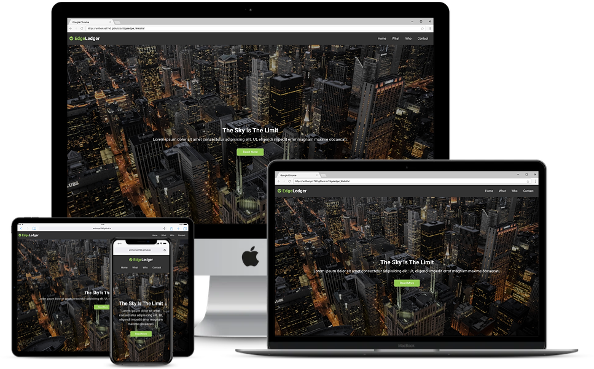

# EdgeLedger Responsive Website

 A Responsive Website created using HTML, CSS &amp; Javascript
 
 This is Responsive Website achieved using HTML, CSS and Javascript. The logic is very simple with the minimum lines of code possible.
 
## Steps to execute this website:
- Download the entire code 
- Open up the index.html.
- [View Live Site](https://anthonys1760.github.io/Edgeledger_Website/)

## Technologies used: 
- HTML
- CSS [Flexbox]
- Javascript
- jQuery
- Google Maps API

